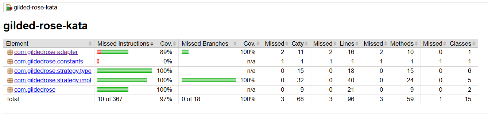

# 🏨 **Gilded Rose Inventory System**

Welcome to Team Gilded Rose!
We operate a small but renowned inn in a bustling city, run by the ever-charming innkeeper Allison.
Our commitment to excellence means we only buy and sell the finest goods.

📦 **Core Domain Concepts**
Every item in the system has:

- SellIn: The number of days remaining to sell the item
- Quality: A measure of the item's value

📉 **Daily Update Rules**

At the end of each day, the system:

- Decreases SellIn by 1
- Decreases Quality by 1

  But it doesn’t end there...

🧠 **Business Rules**

Once the SellIn date has passed, Quality degrades twice as fast 
The Quality of an item is never negative

💡Aged Brie : 

       Increases in quality the older it gets.

💡Sulfuras (Legendary Item) : 

       quality and sellIn never change. Maximum quality is 80.

💡Backstage passes : Increases in quality as its sellIn value approaches:

       quality increases by 2 when there are 10 days or less.

       quality increases by 3 when there are 5 days or less.

       quality drops to 0 after the concert.

🧪 **New Feature: Conjured Items**

We’ve now partnered with a supplier of Conjured items.
These magical goods require an update to our system:
          
     "Conjured" items degrade in quality twice as fast as normal items

# 🔧 Tools Used

---
### 🖥️ **Backend**
- **Java 17**

### 🏗️ **Build Tool**
- **Maven 3.9.9**

### 📊 **Reporting**
- **Jacoco 0.8.13**

### 🖥️ **IDE**
- **IntelliJ IDEA Ultimate 2023.2.4**

# Gilded Rose - Refactoring journey

## 🏗️ **How to Build the Application**

**1. Clone the Repository**

     bash
     git clone https://github.com/2024-DEV3-005/GildedRose-Refactoring-kata

**2. Build the Project and Run Tests**

     mvn clean install

## 🏗️ **How to Refactor the Application**

This project is a refactoring kata, meaning the code is already written, and your task is to improve it.

### **1. Understand the Existing Code**
-     Familiarize the existing codebase, especially the `GildedRose` class and its `updateQuality` method.
-     Review the `Item` class and its subclasses to understand how different items behave.
-     Pay attention to the business rules and how they are currently implemented.
-     Identify areas of the code that are difficult to read, maintain, or extend.
-     Look for code smells such as duplicated logic, long methods, and complex conditionals using SonarQube scan
-     Identify any potential performance issues, especially with the way items are updated.
- 
### **2. Steps to consider for Refactoring**

-     Think about how you can break down the `updateQuality` method into smaller, more manageable methods or classes.
-     Consider design patterns that could help simplify the code, such as Strategy or Adapter patterns.
-     Consider the Single Responsibility Principle (SRP) and how it applies to the `GildedRose` class.
-     Identify any potential performance issues, especially with the way items are updated.
-     Look for opportunities to improve test coverage, especially for edge cases and complex logic.
-     Consider how you can make the code more flexible for future changes, such as adding new item types or business rules.
-     Think about how you can improve the readability of the code, such as using meaningful variable names and reducing complexity.
-     Consider how you can make the code more modular, allowing for easier testing and maintenance.
-     Look for opportunities to use functional programming techniques, such as streams and lambdas, to simplify the code.
-     Use TDD where ever possible to ensure that your refactoring does not break existing functionality.
-     Use DRY (Don't Repeat Yourself) principles to avoid code duplication.
-     Remove dead code and unused methods to keep the codebase clean.
-     Avoid unncecessary object creation to improve performance.

### **3. Refactor the Code**
  
-     Start refactoring the code based on your analysis and the steps you identified.
-     Make small, incremental changes and run tests frequently to ensure you don't break existing functionality.
-     Use meaningful commit messages to document your changes and the reasons behind them.
-     pair programming with a colleague or use code reviews to get feedback on your changes.
-     four-eye principle to ensure that your changes are reviewed and approved by another developer.

### **4. Test Your Changes**
-     Run the existing tests to ensure that your refactoring does not break any functionality.
-     Write new tests for any new functionality or edge cases you introduce.
-     Introduced approval tests to ensure that the system behaves as expected after refactoring.
-     Use Jacoco to check code coverage and ensure that your tests cover all critical paths.

### **5. Review and Document Your Changes**
-     Review your changes to ensure they meet the project's coding standards and best practices.
-     Update the README file to reflect any changes in the system's behavior or business rules.

## Design Patterns Used
- **Strategy Pattern**: Used to encapsulate the different update strategies for various Quality types, allowing for easy extension and modification.
- **Factory Pattern**: Used to create instances of different Strategy Objects based on the Item names, promoting code reusability and separation of concerns.
- **Adapter Pattern**: Used to adapt the existing Item class to the new requirements of the Gilded Rose system, allowing for easier integration of new item types.

## 📊 **How to Access the Code Coverage Report **

**1. Clone the Repository**

**2. Run maven build**

       mvn clean install

**3. Find Jacoco report in the below path**

    $buildDir/target/site/jacoco/index.html

**4. Test Result After Refactoring**

